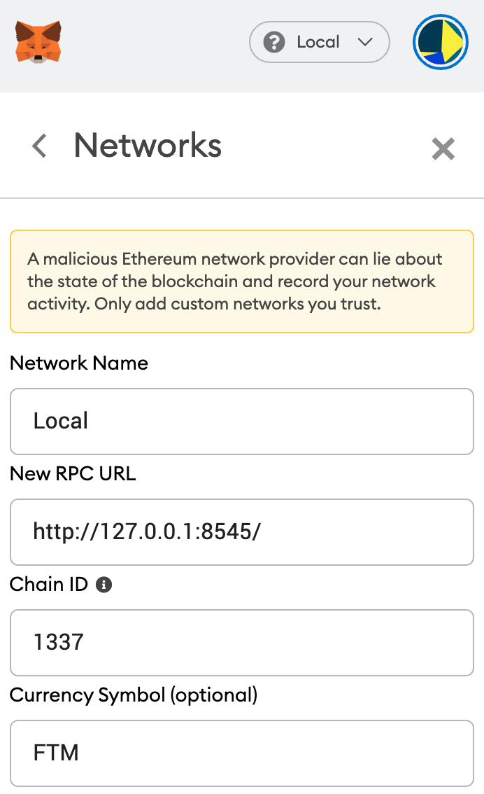

# Fantom-Game ERC721 based game

Non-Fungible Tokens, or NFTs in short, have recently gained significant popularity due to the rising trend in the blockchain gaming space. Ever since their inception, NFTs became really popular among the crypto community, thanks to successful projects like Cryptokitties and CryptoPunks, etc.

Cryptokitties is one of the most hyped NFT projects within the DeFi and blockchain gaming space. CryptoKitties are digital, collectible cats built on the Ethereum blockchain, and they can be bought and sold using Ethereum, and bred to create new cats with several traits and varying characteristics.

CryptoKitties is basically a digital pet community centred around collecting, training, raising, and battling fantasy creatures that are known as ‘CryptoFantom’. Each CryptoFantom has unique genetic data stored on Opera. 

A CryptoFantom can possess two different genes with different body parts. This smart contract serves as an example, and can be a good starting point for anyone who is looking to build NFT based products on the Fantom blockchain platform. 

[](https://travis-ci.org/joemccann/dillinger)

## Prerequisite

Install truffle and Ganache-CLI
```sh
$ npm install -g truffle
$ npm install -g ganache-cli
```

Clone the project
```sh
$ git clone https://github.com/Fantom-foundation/crypto-fantom-game.git
```

> This project is for test purpose only, it contains only the basic functions and minimum requirements.

```sh
$ npm install
```

## Deploy locally and interact with frontend

Start by running Ganache-CLI. It runs a personal Ethereum blockchain on which you can use to run tests, execute commands. Run this command:
```sh
$ ganache-cli --deterministic -i 1337
```

You should add a new network to your Metamask, here is the configuration:



Then deploy the contract by running this command:
```sh
$ truffle migrate --network testrpc --reset
```

Go to the app folder
```sh
$ cd app
```

then you can finally run to display the front
```sh
$ npm run start
```

## Issues
You may encounter some problems with the current version of Metamask which does not detect the correct nonce,
you can switch from network to Mainnet and then back to Local that solves most of the issues until a correction is made.
